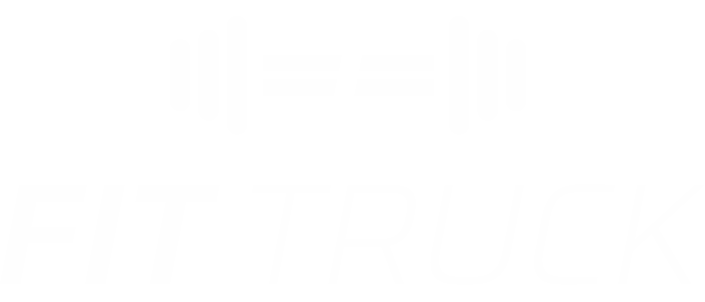

<a id="readme-top"></a>

<!-- PROJECT SHIELDS -->
[![Contributors][contributors-shield]][contributors-url]
[![Forks][forks-shield]][forks-url]
[![Stargazers][stars-shield]][stars-url]
[![Issues][issues-shield]][issues-url]
[![Unlicense License][license-shield]][license-url]
[![LinkedIn][linkedin-shield]][linkedin-url]


<!-- PROJECT LOGO -->
<br />
<div align="center">
  <a href="https://github.com/fernan-x/killian-coaching">
    
  </a>

  <h3 align="center">Fit truck / Killian Coaching</h3>

  <p align="center">
    SEO-optimized website for Killian Coaching and its unique Fit Truck concept.
    <br />
    <a href="https://github.com/fernan-x/killian-coaching"><strong>Explore the docs »</strong></a>
    <br />
    <br />
    <a href="https://fernan-x.github.io/killian-coaching/">View Demo</a>
    &middot;
    <a href="https://www.fittruck-nantes.com/">Live Project</a>
    &middot;
    <a href="https://github.com/fernan-x/killian-coaching/issues/new?labels=bug&template=bug-report---.md">Report Bug</a>
    &middot;
    <a href="https://github.com/fernan-x/killian-coaching/issues/new?labels=enhancement&template=feature-request---.md">Request Feature</a>
  </p>
</div>


<!-- ABOUT THE PROJECT -->
## About The Project

[![Product Name Screen Shot][product-screenshot]](https://www.fittruck-nantes.com/)

Killian Coaching was born out of a desire to help my coach enhance their online presence and grow their coaching business. The original website lacked modern design elements and effective SEO strategies, limiting its ability to attract and engage potential clients. This project aims to solve those issues by delivering:

* **Improved User Experience**: A clean, intuitive, and responsive design that makes it easy for visitors to learn about coaching services and get in touch.
* **Enhanced SEO Performance**: Optimized content structure, metadata, and loading speed to improve search engine rankings and increase organic traffic.
* **Content Management Flexibility**: A scalable and maintainable architecture to support content updates and future growth.

This project is a collaboration fueled by a passion for web development and a belief in the transformative power of great coaching. By bridging technical know-how with the coach's expertise, Killian Coaching provides a strong digital foundation to support business growth and client engagement.

<p align="right">(<a href="#readme-top">back to top</a>)</p>


### Built With

This section should list any major frameworks/libraries used to bootstrap your project. Leave any add-ons/plugins for the acknowledgements section. Here are a few examples.

* [![Next][Next.js]][Next-url]
* [![React][React.js]][React-url]

<p align="right">(<a href="#readme-top">back to top</a>)</p>


<!-- GETTING STARTED -->
## Getting Started

### Installation

1. Clone the repo
   ```sh
   git clone https://github.com/fernan-x/killian-coaching.git
   ```
2. Install NPM packages
   ```sh
   yarn
   ```
3. Run the web server
   ```sh
   yarn dev
   ```

### Build

1. Create the `.env` file
   ```sh
   cp .env.example .env
   ```
2. Fill the `.env` file
_(Do not forget to set the `NEXT_LOCAL_BUILD` variable to `true` in the `.env` file)_
    ```sh
    # .env
    NEXT_LOCAL_BUILD=true
    ```
3. Build the static site
   ```sh
   yarn build
   ```
4. Deploy the static site

<p align="right">(<a href="#readme-top">back to top</a>)</p>

<!-- CONTRIBUTING -->
## Contributing

Contributions are what make the open source community such an amazing place to learn, inspire, and create. Any contributions you make are **greatly appreciated**.

If you have a suggestion that would make this better, please fork the repo and create a pull request. You can also simply open an issue with the tag "enhancement".
Don't forget to give the project a star! Thanks again!

1. Fork the Project
2. Create your Feature Branch (`git checkout -b feature/AmazingFeature`)
3. Commit your Changes (`git commit -m 'Add some AmazingFeature'`)
4. Push to the Branch (`git push origin feature/AmazingFeature`)
5. Open a Pull Request

### Top contributors:

<a href="https://github.com/fernan-x/killian-coaching/graphs/contributors">
  
</a>

<p align="right">(<a href="#readme-top">back to top</a>)</p>

<!-- CONTACT -->
## Contact

Fabien FERNANDES ALVES - [Linkedin](https://www.linkedin.com/in/fabien-fernandes-alves/) - fernandesalvesfabien@gmail.com

Project Link: [https://github.com/fernan-x/killian-coaching](https://github.com/fernan-x/killian-coaching)

<p align="right">(<a href="#readme-top">back to top</a>)</p>

<!-- MARKDOWN LINKS & IMAGES -->
<!-- https://www.markdownguide.org/basic-syntax/#reference-style-links -->
[contributors-shield]: https://img.shields.io/github/contributors/fernan-x/killian-coaching.svg?style=for-the-badge
[contributors-url]: https://github.com/fernan-x/killian-coaching/graphs/contributors
[forks-shield]: https://img.shields.io/github/forks/fernan-x/killian-coaching.svg?style=for-the-badge
[forks-url]: https://github.com/fernan-x/killian-coaching/network/members
[stars-shield]: https://img.shields.io/github/stars/fernan-x/killian-coaching.svg?style=for-the-badge
[stars-url]: https://github.com/fernan-x/killian-coaching/stargazers
[issues-shield]: https://img.shields.io/github/issues/fernan-x/killian-coaching.svg?style=for-the-badge
[issues-url]: https://github.com/fernan-x/killian-coaching/issues
[license-shield]: https://img.shields.io/github/license/fernan-x/killian-coaching.svg?style=for-the-badge
[license-url]: https://github.com/fernan-x/killian-coaching/blob/master/LICENSE.txt
[linkedin-shield]: https://img.shields.io/badge/-LinkedIn-black.svg?style=for-the-badge&logo=linkedin&colorB=555
[linkedin-url]: https://linkedin.com/in/fabien-fernandes-alves/
[product-screenshot]: public/og-image.png
[Next.js]: https://img.shields.io/badge/next.js-000000?style=for-the-badge&logo=nextdotjs&logoColor=white
[Next-url]: https://nextjs.org/
[React.js]: https://img.shields.io/badge/React-20232A?style=for-the-badge&logo=react&logoColor=61DAFB
[React-url]: https://reactjs.org/
